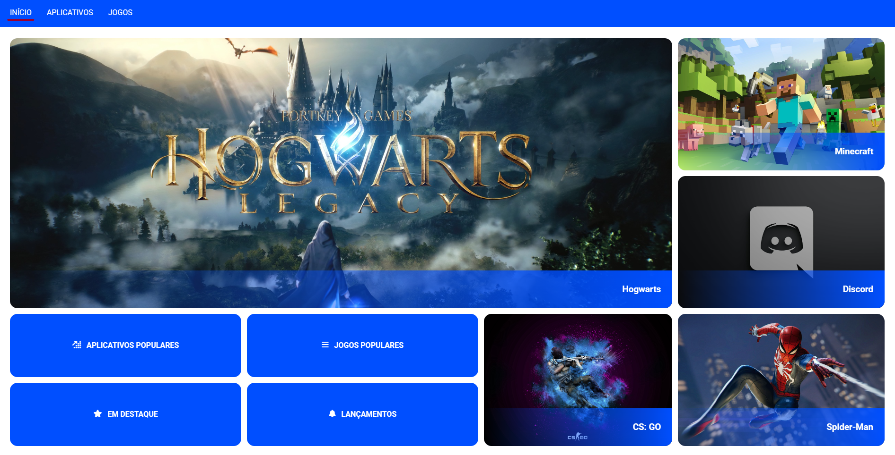

# Alura Store (Explorando ícones e grid com Alura)



**Alura Store** é uma landing page fruto dos meus estudos, refinado com os ensinamentos especializados da Alura. Foi desenvolvida para aprimorar minhas habilidades em grid layout e uso de ícones como fonte, oferece uma oportunidade prática para mergulhar em um layout básico e eficaz.

## Credits

This project was developed based on the knowledge acquired through courses and educational materials provided by [alura](https://www.alura.com.br). Rockseat offers a wide range of high-quality courses and content for developers in various areas, including design, programming, and app development.

We would like to thank the Rockseat team for providing valuable educational resources that contributed to the development of this project.

For more information about the courses and materials offered by Alura, please visit the official website at [alura](https://www.alura.com.br).

## Technology

The following are the key technologies and tools used in the development of this app:

- **HTML/SCSS**: Used for structuring and styling the page.
- **Grid**: Set the elements as a grid container
- **Icomoon**: A platform where you can create icon packs, and use icons as fonts.

## How to View Alura Store

To view this Alura Store locally, follow these steps:

1. Clone the repository:

   ```bash
    git clone https://github.com/edsoncamargo/alura-store
    cd your-path/alura-store
   ```

2. Install Node.js: Sass is built with Node.js, so you need to install it first. You can download and install Node.js from the official website: Node.js.

3. Install Sass globally via npm:

   ```bash
    npm install -g sass
   ```

4. Compile scss in project root:

   ```bash
    sass --watch ./assets/styles/scss/main.scss:./assets/styles/css/styles.css
   ```

5. Install the Live Server extension in VS Code, and GO LIVE!

## Using icons

- Learn to use [Icons - README.md](/assets/icons/README.md)

## Contribution

You are welcome to contribute to the development of this project. If you find bugs, wish to add new features, or improve usability, feel free to open an issue or submit a pull request.

## Contact

- Name: Edson Camargo Menezes
- Email: contact@edsoncamargo.dev

## Acknowledgments

Special thanks to everyone who contributed to making this app a reality, especially Alura for their invaluable support and guidance throughout the development process. Your expertise and dedication have been instrumental in bringing this project to fruition.

Enjoy using **Alura Store!**
